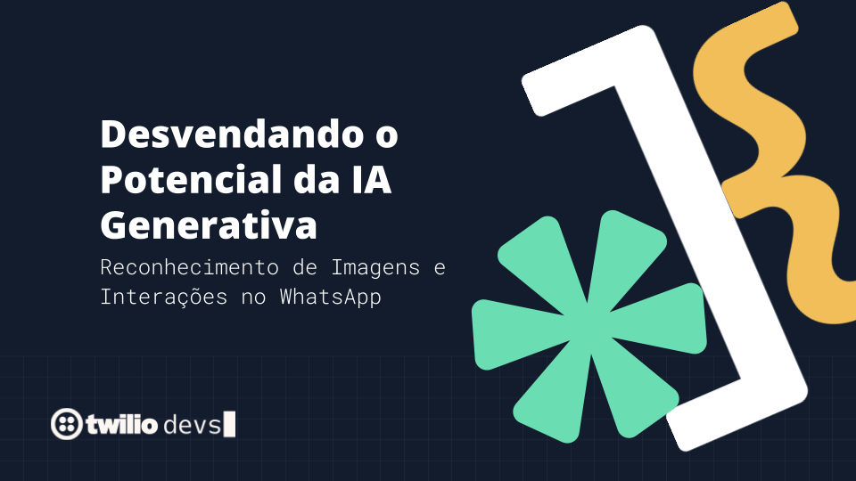

# Workshop Desvendando o Potencial da IA Generativa
## Reconhecimento de Imagens e Interações no WhatsApp

Este workshop foi realizado em alguns eventos
* TDC Summit São Paulo, dia 27/03/2024 por [Luís Leão](https://linkedin.com/in/luisleao) e [Pedro Markun](https://linkedin.com/in/pedromarkun).
* TDC Floripa, dia 13/06/2024 por [Luís Leão](https://linkedin.com/in/luisleao).

Você deve realizar os seguintes passos:

* criar uma conta na Twilio com o link https://twil.io/workshop-ia
* criar uma conta na OpenAI e gerar uma chave pelo link https://platform.openai.com/api-keys
* caso deseje utilizar outro modelo como o Gemini, por exemplo, gere sua chave pelo link https://aistudio.google.com/app/apikey?hl=pt-br
* cada branch corresponde a uma etapa de implementação do workshop.

# Prática 1
* Ativar a Sandbox de WhatsApp
* Criando um Fluxo no Twilio Studio
* Conectando a Sandbox com Twilio Studio
* Tratar recebimento de Arquivos
